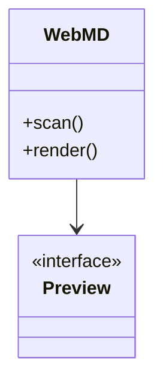

# 图示样例（站内已支持）

Markdown 里的 **Mermaid** 可以渲染流程图 / 简易 UML 风格图（不依赖 .puml / .xmind 文件）。

## 流程图

## 简易类图

独立文件样例（侧栏 notes）：

- [sample.puml](/f/notes/sample.puml/) — PlantUML
- [sample.drawio](/f/notes/sample.drawio/) — diagrams.net
- [sample.mm](/f/notes/sample.mm/) — FreeMind
- [sample.xmind](/f/notes/sample.xmind/) — XMind

