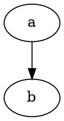
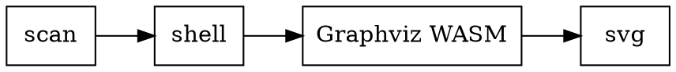
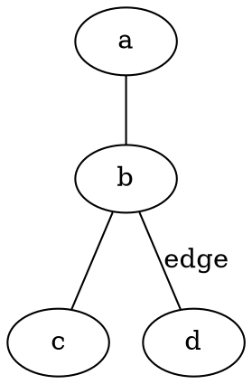
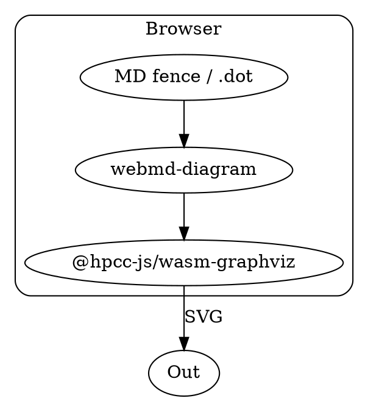

# 图示样例（Graphviz · 文内）

与 Mermaid / PlantUML 相同：**类型栏 + 内容区 + 复制 DOT 源码**。  
引擎：`@hpcc-js/wasm-graphviz`（浏览器 WASM，无本机 Graphviz、无公网）。

````text

````

别名：` ```graphviz ` / ` ```gv `。  
独立文件：`.dot` / `.gv` → 如 [/pages/samples/diagrams/graphviz/sample.dot/](/pages/samples/diagrams/graphviz/sample.dot/)

---

## 1. digraph（有向）



## 2. graph（无向）



## 3. 稍复杂


