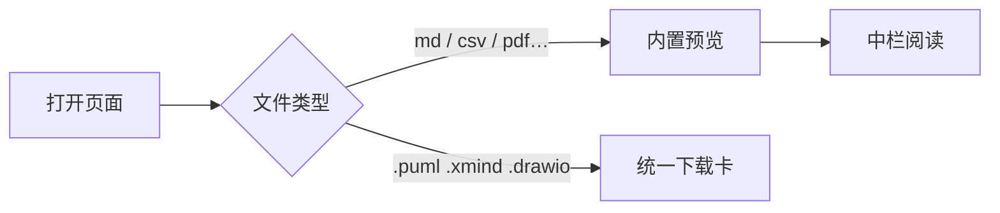
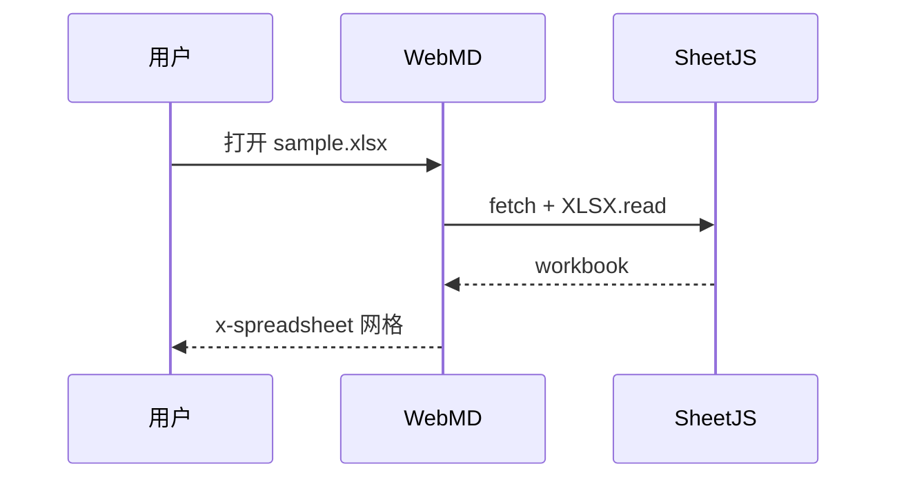
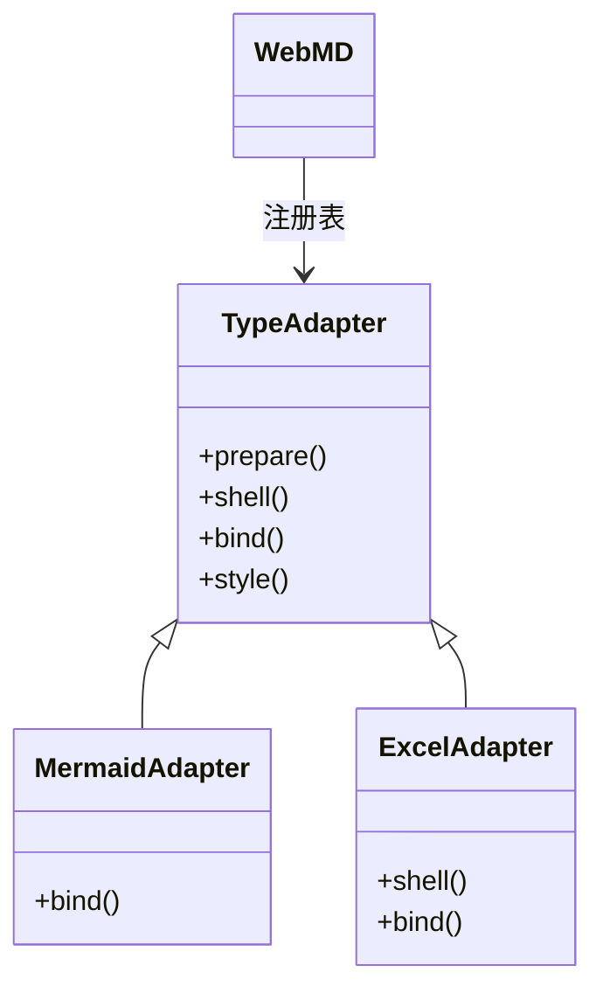
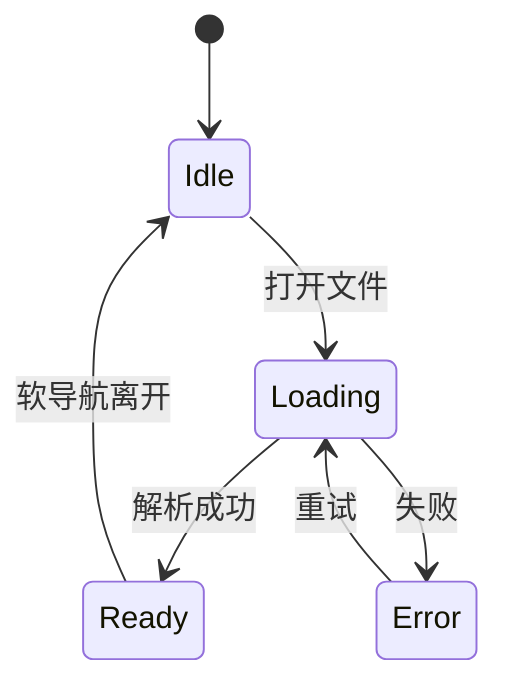
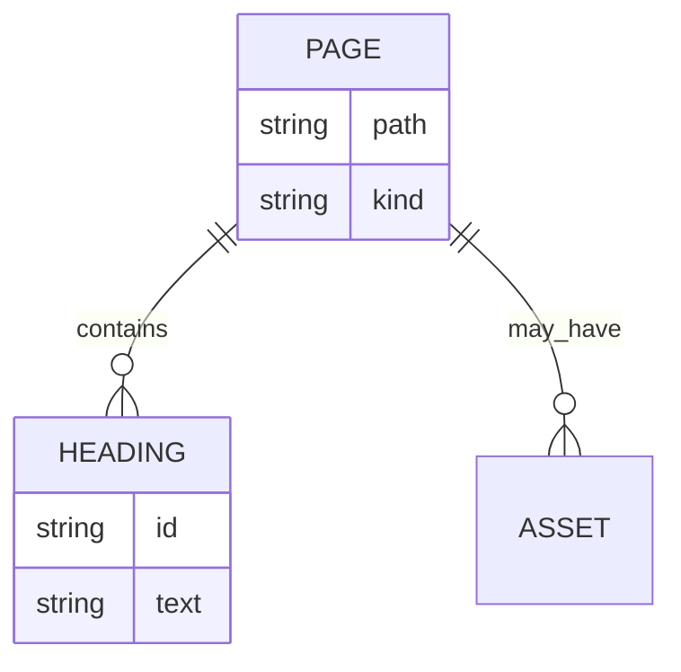
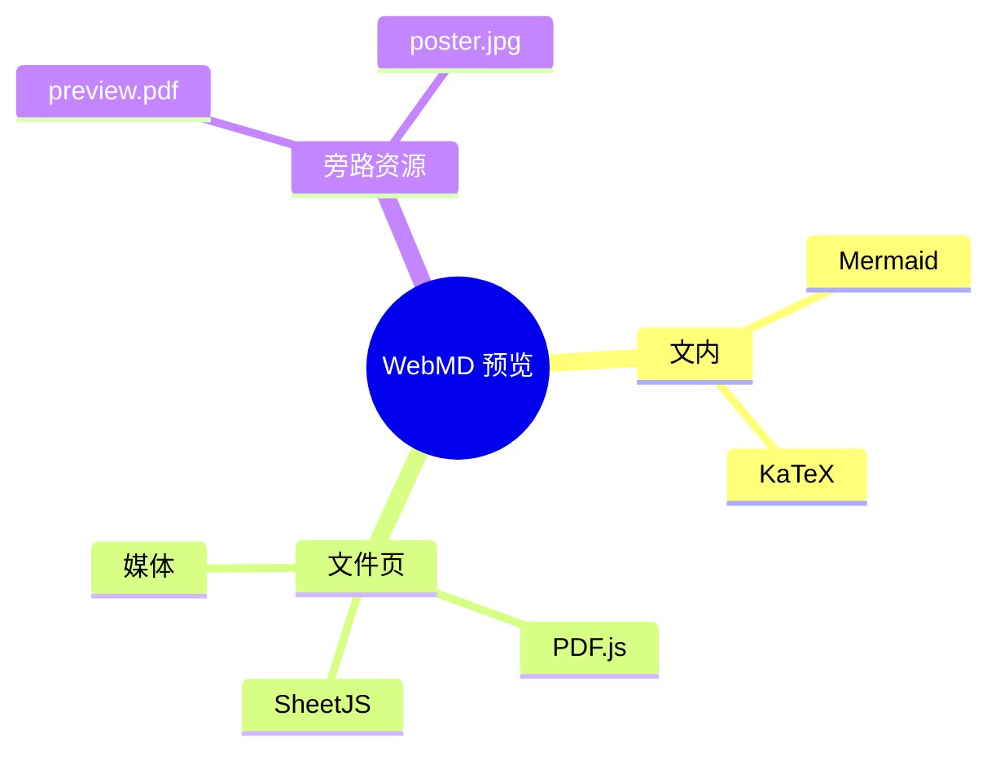
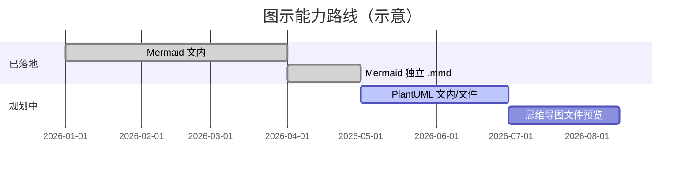
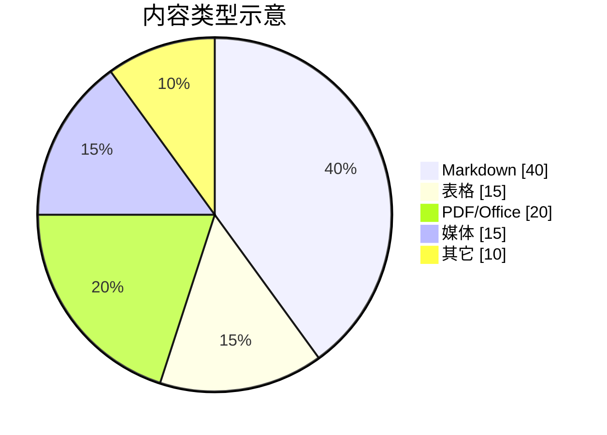

# 图示样例（Mermaid · 文内）

站内 **Markdown** 里用代码块即可画图：

````text

````

也可用别名：` ```mmd `。

实现：`markdown.ts`（shell）+ `src/previews/mermaid.ts`（bind）。

**独立 `.mmd` 文件**（整页渲染，便于单图测试）在同目录下的 [mermaid/](./mermaid/)：

| 文件 | 图种 |
|------|------|
| [flowchart.mmd](/pages/samples/diagrams/mermaid/flowchart.mmd/) | 流程图 |
| [sequence.mmd](/pages/samples/diagrams/mermaid/sequence.mmd/) | 时序图 |
| [class.mmd](/pages/samples/diagrams/mermaid/class.mmd/) | 类图 |
| [state.mmd](/pages/samples/diagrams/mermaid/state.mmd/) | 状态图 |
| [er.mmd](/pages/samples/diagrams/mermaid/er.mmd/) | ER |
| [mindmap.mmd](/pages/samples/diagrams/mermaid/mindmap.mmd/) | 思维导图 |
| [gantt.mmd](/pages/samples/diagrams/mermaid/gantt.mmd/) | 甘特 |
| [pie.mmd](/pages/samples/diagrams/mermaid/pie.mmd/) | 饼图 |
| [standalone.mermaid](/pages/samples/diagrams/mermaid/standalone.mermaid/) | 扩展名 `.mermaid`（与 `.mmd` 同引擎） |

---

## 1. 流程图 flowchart



## 2. 时序图 sequenceDiagram



## 3. 类图 classDiagram（简易 UML）



## 4. 状态图 stateDiagram



## 5. ER 图 erDiagram



## 6. 思维导图 mindmap



## 7. 甘特 gantt



## 8. 饼图 pie



---

## 尚未渲染（独立文件 · 下载卡）

| 样例 | 格式 | 现状 | 说明 |
|------|------|------|------|
| [sample.puml](/pages/samples/diagrams/plantuml/sample.puml/) | PlantUML | **仅下载** | 源是文本，可以后文内/`prepare→SVG`；**现在站内不画** |
| [sample.drawio](/pages/samples/diagrams/drawio/sample.drawio/) | diagrams.net | **仅下载** | 可导出 SVG 放仓库用图片页；**未接 viewer** |
| [sample.mm](/pages/samples/diagrams/mindmap/sample.mm/) | FreeMind | **仅下载** | XML，无通用浏览器原生；可导出图 |
| [sample.xmind](/pages/samples/diagrams/mindmap/sample.xmind/) | XMind | **仅下载** | zip 包，完整预览重 |

**「仅下载」= 当前没有 shell/bind，页面只有统一下载卡**，不能在中栏当图看。  
**「未做」**（如 Graphviz / Excalidraw 文内）= 还没接适配器；技术上可以嵌 HTML，但 **尚未实现**。

设计原则：一种类型一套 prepare / shell / bind / style，见 `docs/diagrams.md`。
