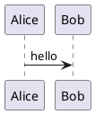
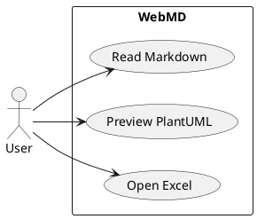
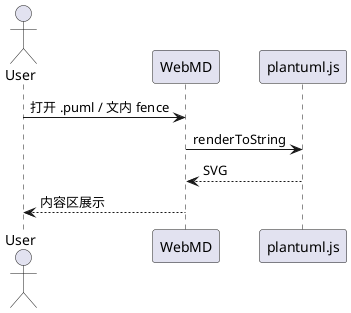
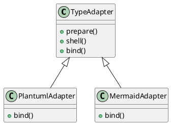
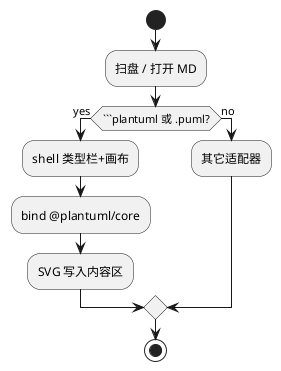

# 图示样例（PlantUML · 文内）

与 Mermaid 相同：**类型栏 + 内容区 + 复制源码**。  
引擎：浏览器内 `@plantuml/core`（TeaVM），**不请求公网 PlantUML 服务**。

````text

````

也可用别名：` ```puml `。

独立文件：`content/samples/diagrams/plantuml/*.puml`  
（如 [/pages/samples/diagrams/plantuml/sample.puml/](/pages/samples/diagrams/plantuml/sample.puml/)）

---

## 1. 用例图



## 2. 时序图



## 3. 类图（简）



## 4. 活动图


