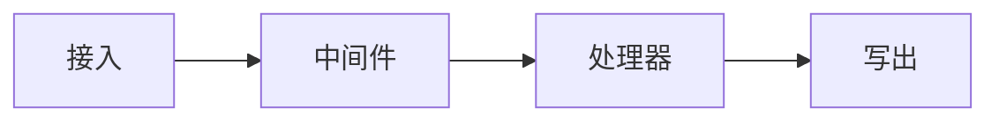

# 请求生命周期（Request Lifecycle）

### 缩写：无

### 简述

从接受到响应完成的服务端处理路径：接入、中间件、业务、写出。

### 组成与要点

```mermaid
flowchart LR
  接入-->中间件-->处理器-->写出
```

### 实践与应用

• 日志带 request id
• 各阶段超时

### 关联术语

• 中间件：横切
• 可观测性：埋点
