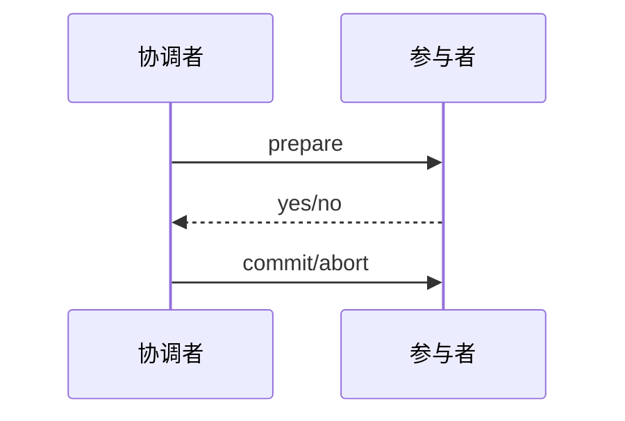

# 两阶段提交（Two-Phase Commit）

### 缩写：2PC

### 简述

分布式事务协议：准备阶段各参与者预提交并投票，提交阶段根据协调者决定统一 commit/abort。追求跨资源原子性，代价是延迟与阻塞风险。

### 为何出现

单机事务无法覆盖多个独立资源管理器。

### 使用场景

跨库/库与消息等需要原子的遗留集成；理解 XA。

### 在体系中的位置

协调者 + 参与者；依赖预写日志与超时恢复。

### 组成与要点

### 实践与应用

• 优先评估是否可改为本地事务+可靠消息/Saga。
• 若用 2PC，监控准备后阻塞与协调者高可用。
• 超时与人工干预流程要事先定义。

### 注意事项

• 协调者故障可导致参与者阻塞。
• 跨地域 2PC 延迟与可用性差。

### 对比与易混

2PC vs TCC/Saga；2PC vs 复制共识（Raft 等）。

### 信号与度量

事务完成时延、启发式结束次数、阻塞事务。

### 关联术语

• 分布式事务：典型协议
• 协调者 / 参与者：角色
• 最终一致性：较弱但更常见的替代取向
