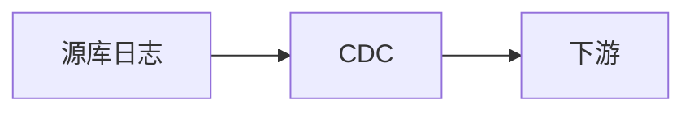

# 变更数据捕获（Change Data Capture）

### 缩写：CDC

### 简述

持续捕获表数据变更（增删改）并发布给下游的技术，多基于事务日志解析，而非轮询表。

### 为何出现

批抽数延迟高且压主库；需要近实时同步与事件驱动。

### 使用场景

数仓同步、搜索索引更新、缓存失效、微服务数据对接。

### 在体系中的位置

源库日志 → CDC 连接器 → 消息总线 → 消费者。

### 组成与要点

### 实践与应用

• 选日志级 CDC 减侵入。
• 下游幂等与顺序（按主键）处理。
• 监控位点延迟与 schema 变更兼容。

### 注意事项

• 大事务与 DDL 是常见坑。
• 权限与日志保留影响捕获。

### 对比与易混

CDC vs 定时 ETL；CDC vs 触发器出站。

### 信号与度量

位点延迟、吞吐、重放次数。

### 关联术语

• 日志：变更来源
• 消息队列：常见下游
• 数仓 / 搜索：典型消费者
