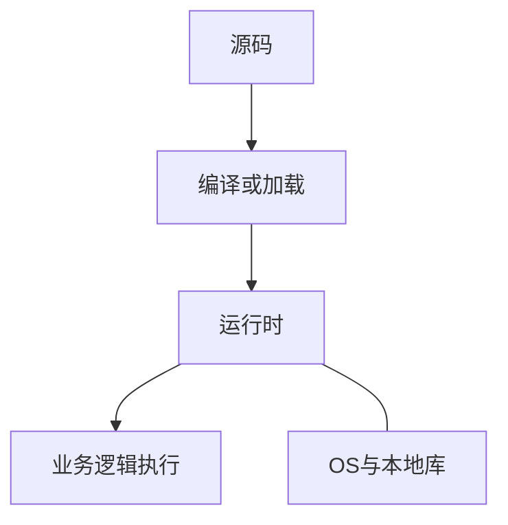

# 运行时（Runtime）

### 缩写：无

### 简述

程序执行时所依赖的环境与配套机制的统称：语言虚拟机、解释器、标准库支持、垃圾回收、调度与反射等。狭义可指「运行时系统」；广义也包括 OS 进程环境与部署的基础库。源码语义最终通过运行时落地为真实行为。

### 使用场景

讨论 GC 停顿、部署镜像体积、多版本运行时并存、冷启动与热路径性能。

### 在体系中的位置

位于编译/加载之后、具体业务逻辑执行的底座；与操作系统、容器一起构成执行平台。

### 组成与要点

### 实践与应用

• 固定并记录运行时版本，保证构建与生产一致。
• 性能问题区分「算法」与「运行时税」（GC、装箱、解释执行）。
• 特性依赖（语言版本）先查目标运行时是否支持。

### 注意事项

• 「同一语言」不同运行时实现行为可能有差异。
• 在受限运行时（嵌入式、沙箱）上标准库假设不成立。
• 运行时升级可能是破坏性变更。

### 对比与易混

• 编译期：类型检查与代码生成发生的阶段。
• 标准库：常随运行时分发，但概念上是库而非全部运行时机制。

### 关联术语

• 编程语言：运行时实现其语义
• 编译期与运行期：检查与执行发生的阶段划分
• 解释器 / 虚拟机：常见运行时形态
• 垃圾回收：部分运行时的自动内存管理
