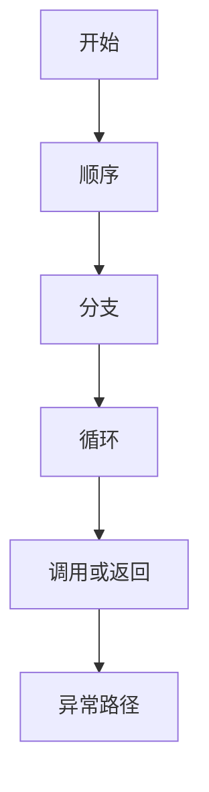

# 控制流（Control Flow）

### 缩写：无

### 简述

程序中指令执行的顺序与路径：顺序、分支、循环、跳转、异常展开与协程让出等。控制流决定「下一步做什么」；清晰的控制流是可读性与正确性的骨架，过深嵌套与随意跳转会显著增加缺陷密度。

### 使用场景

实现业务规则、状态机、错误路径、并发让出点。

### 组成与要点

### 实践与应用

• 优先早返回减少嵌套
• 复杂分支表驱动或策略化
• 异常路径与成功路径同等对待

### 注意事项

• goto 式跳转难以推理
• 隐藏控制流（隐式异常、魔法中间件）难调试

### 关联术语

• 分支 / 循环：控制流的基本构造
• 调用栈：函数调用形成的控制与返回路径
• 异常：用跳转打断正常控制流的错误表达
• 状态机：复杂控制流的结构化替代
