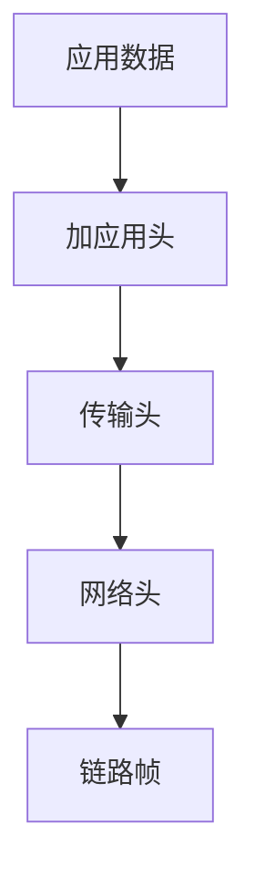

# 封装（Encapsulation）

### 缩写：无

### 简述

把状态与操作边界收拢，限制外部直接触及内部表示的原则与技术。封装保护不变式，使内部可演进而不破坏调用方；通过可见性、模块边界与只读接口等实现。

### 使用场景

类设计、模块私有、不变量维护。

### 组成与要点

### 实践与应用

• 不变量只通过方法维持
• 最小化公开面
• 返回副本或只读视图防逃逸

### 注意事项

• 通过引用逃逸破坏封装
• 为测试打开一切内部会腐蚀边界

### 关联术语

• 协议：封装所实现的层间约定
• MTU：封装后影响路径可达的尺寸上限
• 隧道：多次封装的典型形态
