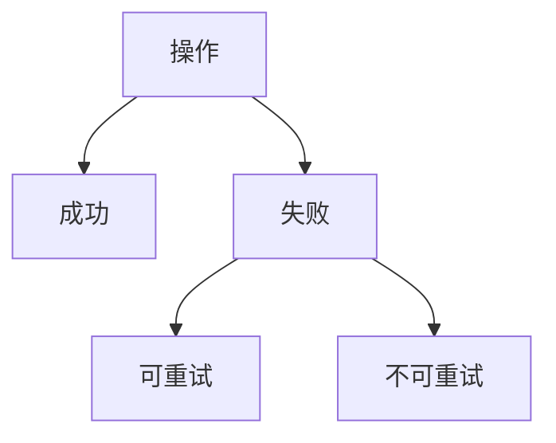

# 错误（Error）

### 缩写：无

### 简述

程序未能完成预期目标时的状态或信号：无效输入、资源不足、不变量破坏、外部失败等。错误需要被检测、传播与处理；忽略错误会转化为数据损坏或更难定位的故障。

### 使用场景

API 失败、校验、部分失败批处理、超时。

### 组成与要点

### 实践与应用

• 区分可重试与不可重试
• 保留足够上下文
• 对用户/调用方给可行动信息

### 注意事项

• 吞掉错误
• 用空值掩盖失败
• 错误信息泄露敏感数据

### 关联术语

• 异常：用控制流表达错误的一种方式
• 错误码：用代码标识失败类别
• 校验：在边界发现输入错误
• 可观测性：错误需可被记录与度量
