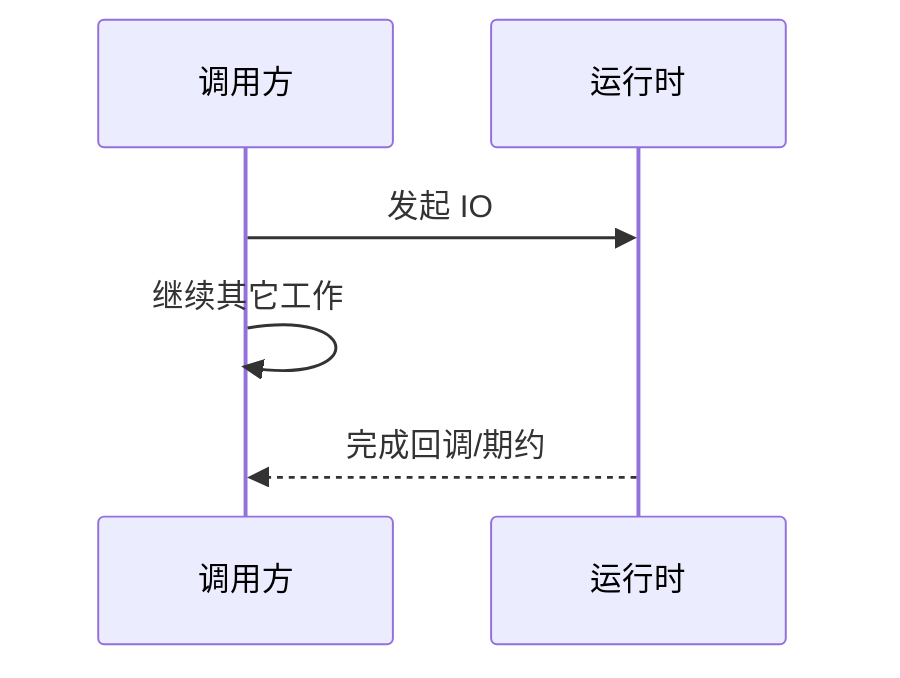

# 异步（Asynchrony）

### 缩写：无

### 简述

发起操作后不阻塞调用方等待完成，而在完成时再继续的执行风格。异步提高 IO 密集场景的资源利用率；需要回调、期约或异步状态机管理续体。

### 使用场景

网络请求、磁盘 IO、UI 事件、定时器。

### 组成与要点

### 实践与应用

• IO 密集优先异步
• 统一错误传播
• 避免异步中再阻塞线程

### 注意事项

• 回调地狱
• 忘记 await
• 取消与超时未贯通

### 关联术语

• 回调：完成时继续的经典机制
• 期约：异步结果的一等表示
• async/await：异步控制流的语法
• 事件循环：调度异步任务的常见运行时
• 并发：异步是组织并发的一种方式
