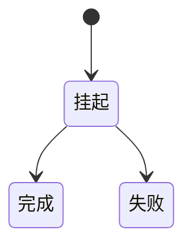

# 期约（Promise）

### 缩写：无

### 简述

代表尚未完成的异步运算最终结果的对象，可处于挂起、完成或失败等状态，并支持组合（then/catch/all 等）。将异步结果一等化，便于组合与错误传播；具体名在语言中可能是 Future/Task。

### 使用场景

HTTP 客户端、并行等待多个 IO、异步流水线。

### 组成与要点

### 实践与应用

• 返回期约的函数保持幂等语义清晰
• 用 all/settled 明确失败策略
• 总是处理拒绝防止未捕获

### 注意事项

• 未处理的 rejection
• 把同步计算硬包成无意义期约

### 关联术语

• 异步：期约表示未完成运算
• 回调：期约之下的完成通知
• async/await：等待期约的语法
• 取消：终止未完成异步的协作机制
