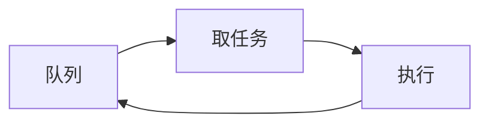

# 事件循环（Event Loop）

### 缩写：无

### 简述

持续从队列取出事件/任务并执行的调度机制，常见于 UI 与部分语言运行时。事件循环模型下，长时间占用循环的同步代码会阻塞所有任务；微任务与宏任务队列策略因实现而异。

### 使用场景

浏览器与 Node 类运行时、GUI 框架、部分游戏循环。

### 组成与要点

### 实践与应用

• 重计算移出循环或分片
• 理解队列优先级以免饿死
• IO 完成回调回到循环的路径要清晰

### 注意事项

• 阻塞事件循环导致全站卡顿
• 与多线程模型混用时的线程亲和

### 关联术语

• 异步：由循环调度的完成回调
• 回调：投递到队列的继续执行
• 任务队列：宏/微任务等调度结构
• 线程：循环通常跑在特定线程上
