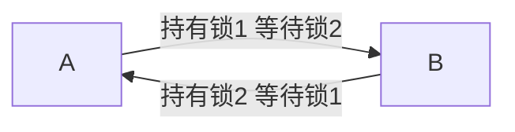

# 死锁（Deadlock）

### 缩写：无

### 简述

多个执行流彼此等待对方持有的资源，导致全部永久阻塞的状态。典型需互斥、占有且等待、不可抢占、循环等待同时成立。预防靠锁顺序、超时与资源分级。

### 使用场景

多锁、线程+DB 锁、分布式锁误用。

### 组成与要点

### 实践与应用

• 统一加锁顺序
• try-lock 超时
• 避免嵌套锁

### 注意事项

• 隐藏锁（库内部）形成环
• 分布式「锁」语义不同

### 关联术语

• 锁：参与资源
• 事务：常见受害者与检测回滚单位
• 超时：破局手段之一
