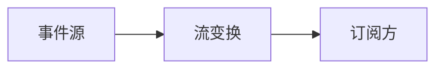

# 响应式编程（Reactive Programming）

### 缩写：无

### 简述

围绕异步数据流与传播变化的编程风格：把事件、值随时间的序列建模为可组合流。适合 UI 事件、实时数据与反压场景；学曲线与调试工具要求较高。

### 使用场景

复杂 UI 状态流、实时行情、传感器数据。

### 组成与要点

### 实践与应用

• 明确订阅生命周期防泄漏
• 背压与错误恢复策略
• 避免过度嵌套操作符

### 注意事项

• 订阅泄漏
• 冷热流语义混淆

### 关联术语

• 异步：流上事件异步到达
• 观察者：订阅变化的经典模式
• 事件：流的元素来源
• 背压：生产者过快时的调控
