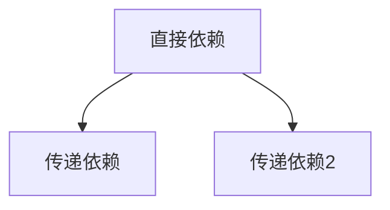

# 依赖（Dependency）

### 缩写：无

### 简述

项目为完成功能而依赖的外部库、工具或服务。直接依赖与传递依赖构成图；版本冲突、许可与漏洞是管理焦点。

### 使用场景

引入库、升级、漏洞响应、许可合规。

### 组成与要点

### 实践与应用

• 最小化直接依赖
• 定期升级与扫描
• 传递依赖也要可知

### 注意事项

• 弃用库
• 许可证不兼容
• 依赖绑架升级

### 关联术语

• 包管理器：安装与解析工具
• 锁文件：可复现安装
• 语义化版本：兼容性意图
• 模块：代码层的依赖边界
