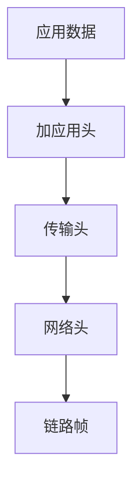

# 封装（Encapsulation）

### 缩写：无

### 简述

把上层数据当作载荷，加上本层头/尾形成 PDU 的过程。抓包时由外向内解头；隧道是多次封装，会吃掉 MTU。

### 使用场景

读包、做隧道/VPN、解释「为何包变大」。

### 组成与要点

### 实践与应用

• 故障定界：错在外层头还是内层载荷语义。
• 每加一层封装预留开销并复查路径 MTU。

### 注意事项

• 加密后内层不可见，观测点要选对。
• 双重封装+双重 NAT 极难排。

### 关联术语

• 协议：封装所实现的层间约定
• MTU：封装后影响路径可达的尺寸上限
• 隧道：多次封装的典型形态
