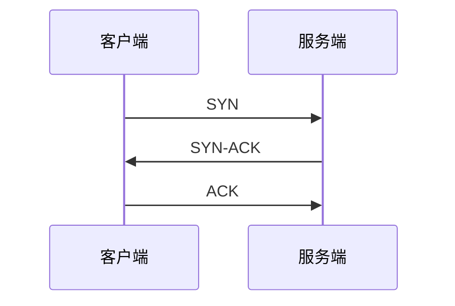

# 三次握手（Three-Way Handshake）

### 缩写：无

### 简述

TCP 建连：SYN → SYN-ACK → ACK，同步初始序号并确认双向可达。半连接队列与 SYN 洪水与此相关。

### 使用场景

建连失败抓包、握手时延、抗扫描/抗洪水。

### 组成与要点

### 实践与应用

• 看卡在第几步区分路由/ACL/未监听/队列满。
• 短连接优化：复用、池化、减少握手次数。

### 注意事项

• 应用「已连接」可能还要完成 TLS 等。

### 关联术语

• TCP：所属协议
• 四次挥手：连接释放过程
• 套接字：应用所见的连接抽象
