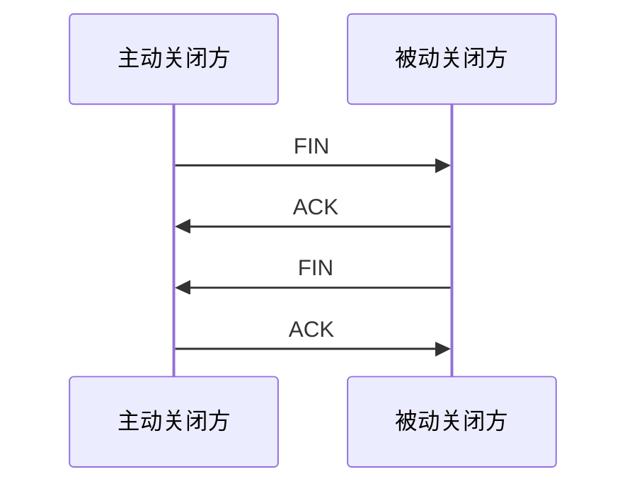

# 四次挥手（Four-Way Handshake）

### 缩写：无

### 简述

TCP 优雅关闭：两端各自 FIN/ACK 结束发送。主动关闭方常进 TIME_WAIT；杀进程常见 RST 而非优雅挥手。

### 使用场景

连接泄漏、TIME_WAIT 过多、半关闭语义。

### 组成与要点

### 实践与应用

• 短连接密集→池化或调协议。
• 分清优雅 FIN 与 RST 重置对业务错误码的影响。

### 注意事项

• 半关闭（只关写）语义需业务明确。

### 关联术语

• TCP：所属协议
• 三次握手：连接建立过程
• TIME_WAIT：主动关闭方常见状态
