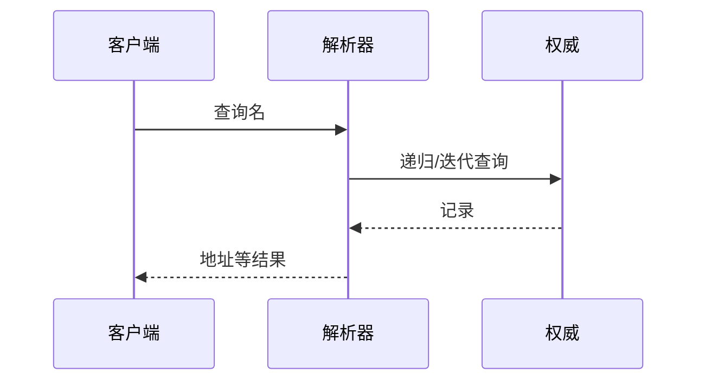

# 域名系统（Domain Name System）

### 缩写：DNS

### 简述

将域名解析为 IP 等记录的分布式系统。缓存与 TTL 使变更非即时；解析失败常被误诊为应用故障。

### 使用场景

访问入口、流量调度、邮件/证书相关记录、排障第一步。

### 组成与要点

### 实践与应用

• 先查答案与 TTL、内网/外网是否分裂视野。
• 变更后关注缓存收敛；关键调度勿只靠无健康检查的 DNS 轮询。

### 注意事项

• 递归器故障会大面积「假全局宕机」。
• 防劫持/注意 DoH/DoT 与企业策略冲突。

### 关联术语

• URL：常含主机名待解析
• IP：解析结果之一
• CDN：常结合 DNS 做调度
