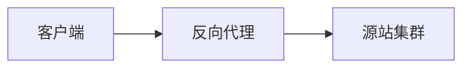

# 反向代理（Reverse Proxy）

### 缩写：无

### 简述

代表服务端接收客户端流量并转后端：统一入口、TLS 终结、路由/灰度。与正向代理方向相反，常与负载均衡能力重叠。

### 使用场景

站点/API 入口、金丝雀、集中证书与 WAF。

### 组成与要点

### 实践与应用

• 路由规则与后端错误映射对外语义。
• 显式支持 WebSocket/gRPC 等流式。

### 注意事项

• IP/协议头信任链配错会导致限流与审计失真。

### 关联术语

• 负载均衡：常同机部署的能力
• TLS 终结：常见职责
• 源站：被代理的上游
