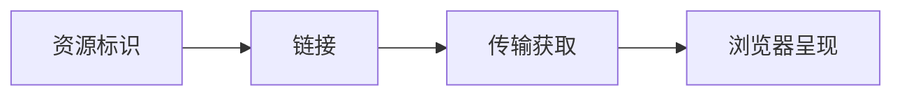

# 万维网（World Wide Web）

### 缩写：WWW

### 简述

通过统一资源标识、超文本链接与应用层协议，在互联网络上发布与访问文档与应用的信息空间。万维网建立在互联网之上，但「网」本身不是物理网络，而是可链接资源的逻辑空间；浏览器是其最常见的客户端。

### 为何出现

需要一种可全球共享、可链接跳转的信息发布与消费方式，而不必为每份资料单独约定传输与展示格式。

### 使用场景

讨论 Web 与互联网的关系、站点与资源寻址、开放平台能力边界。

### 组成与要点

### 实践与应用

• 设计时把「可链接、可缓存、可共享」当作一等约束
• 区分内容资源与仅应用内私有状态
• 公共资源提供稳定标识与合适缓存语义

### 注意事项

• 把 Web 等同于某一浏览器产品
• 忽略链接与标识稳定性导致的长期失效

### 对比与易混

• 互联网：下层互联网络；万维网：其上的超文本应用空间
• 网站：某一主体在 Web 上的站点集合，是 Web 的子集实例

### 来源与线索

常与 URI/URL、HTTP、HTML 标准族一并理解。

### 关联术语

• URL：资源标识与定位
• 超文本 / 超链接：可导航结构
• HTTP：常见获取协议
• 浏览器：主要用户代理
