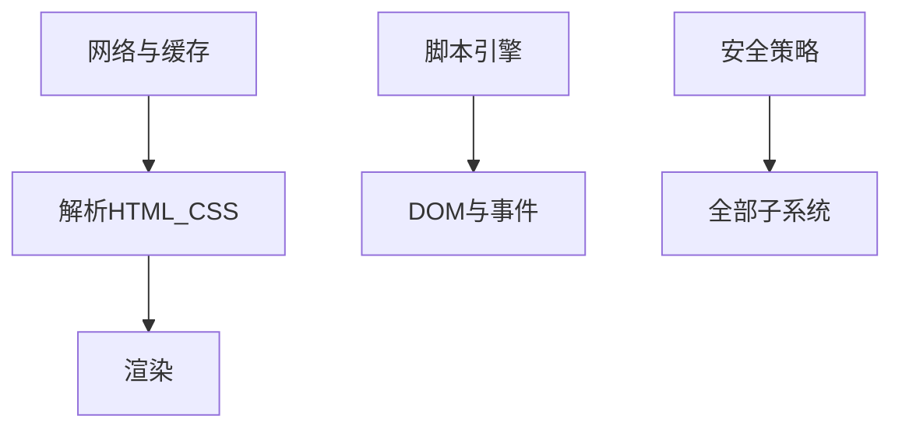

# 浏览器（Web Browser）

### 缩写：无

### 简述

获取、解析并呈现 Web 内容，并执行脚本、管理会话与安全边界的用户代理程序。浏览器实现渲染引擎、网络栈、JavaScript 引擎与权限/沙箱策略，是 Web 平台能力的主要运行载体。

### 使用场景

终端访问、兼容性测试、开发者工具调试、自动化控制。

### 组成与要点

### 实践与应用

• 以现行引擎差异做兼容矩阵，而非只认品牌名
• 用开发者工具验证网络、布局与性能
• 自动化测试锁定浏览器版本策略

### 注意事项

• 同一品牌移动/桌面内核可能不同
• 用户设置（跟踪防护、第三方 Cookie）改变行为

### 关联术语

• 用户代理：更广的客户端类别
• 渲染引擎：呈现子系统
• DOM：脚本可操作的文档树
• 同源策略：安全边界
