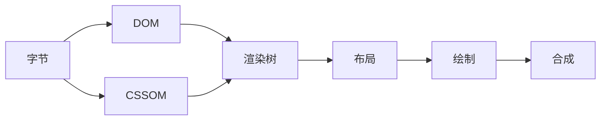

# 关键渲染路径（Critical Rendering Path）

### 缩写：CRP

### 简述

从接收字节到首次像素的关键步骤：解析、样式、布局、绘制、合成。

### 组成与要点

```mermaid
flowchart LR
  字节-->DOM
  字节-->CSSOM
  DOM-->渲染树
  CSSOM-->渲染树
  渲染树-->布局-->绘制-->合成
```

### 实践与应用

• 减少阻塞 CSS/JS
• 关键请求优先级

### 关联术语

• 回流/重绘：后续更新
• 资源提示：加速路径
